# Лист утверждения

```
                                                              УТВЕРЖДАЮ

                                                    Директор по науке и образовательной
                                                    деятельности ООО «РЭНЕРА»,
                                                    Директор Центра химических
                                                    источников тока

                                                    ______________________________
                                                           / Е.А. Чудинов /

                                                    «____» ________________ 2026 г.
                                                              М.П.
```

```
ПРОГРАММНОЕ ОБЕСПЕЧЕНИЕ

ЛАБОРАТОРНОЙ ИНФОРМАЦИОННО-УПРАВЛЯЮЩЕЙ СИСТЕМЫ

«ХИМИЧЕСКИЕ ИСТОЧНИКИ ТОКА»
(ЛИМС-ХИТ)

Техническое обозначение в исходном коде: BADB


ПОЯСНИТЕЛЬНАЯ ЗАПИСКА

BADB.00001-01 81 01
(обозначение — @уточнить)


Лист утверждения

2026
```

---

# Аннотация

Настоящая пояснительная записка составлена в соответствии с ГОСТ 19.404-79 «ЕСПД. Пояснительная записка. Требования к содержанию и оформлению».

Документ излагает:

- обоснование целесообразности разработки программы;
- обоснование выбора архитектуры, языков программирования, технологий;
- описание логической модели данных и структуры базы данных;
- описание взаимодействия компонентов системы;
- ожидаемые технико-экономические показатели;
- перечень использованных источников.

---

# Содержание

1. Введение
2. Назначение и область применения
3. Технические характеристики
   - 3.1. Постановка задачи и обоснование её актуальности
   - 3.2. Обоснование выбора архитектурной модели
   - 3.3. Обоснование выбора технологического стека
   - 3.4. Описание логической модели данных
   - 3.5. Описание физической структуры базы данных
   - 3.6. Описание потоков данных
   - 3.7. Обоснование решений по безопасности
4. Ожидаемые технико-экономические показатели
5. Источники разработки
6. Приложения

---

# 1. Введение

Разработка программного обеспечения **лабораторной информационно-управляющей системы «Химические источники тока»** (далее — **ЛИМС-ХИТ**; техническое обозначение в исходном коде — **BADB**) ведётся Центром химических источников тока ООО «РЭНЕРА» (ГК «Росатом») с 28 января 2026 года.

Цель разработки — обеспечить подразделения Центра химических источников тока единым централизованным инструментом учёта, анализа и документирования R&D-деятельности по разработке химических источников тока (ХИТ): электродных материалов, электролитов, сепараторов, собранных ячеек и батарейных модулей различных электрохимических систем — от закупки исходных материалов и приготовления электродной ленты до электрохимических испытаний готовых изделий.

Настоящий документ обосновывает принятые в ходе разработки проектные решения.

---

# 2. Назначение и область применения

Назначение программы и область её применения описаны в разделе 3 **ТЗ BADB.00001-01**. В настоящем документе приведено сопутствующее обоснование.

Программа относится к классу **LIMS** (Laboratory Information Management System) с научной специализацией на области R&D химических источников тока (разработка электродных материалов, электролитов, сепараторов, ячеек и модулей различных электрохимических систем). По сравнению с универсальными LIMS-решениями (LabWare, STARLIMS и подобные), собственная разработка оправдана следующими факторами:

1. **Узкая специфика предметной области.** Универсальные LIMS требуют значительной настройки для отражения терминологии и бизнес-правил конкретной области (ленты, партии нарезки, рецептуры смесей, электрохимические характеристики). Трудоёмкость настройки сравнима с разработкой специализированного решения.
2. **Ограничение на внешние сервисы.** Большинство современных LIMS-платформ ориентированы на облачное развёртывание или требуют лицензий, не совместимых с ограничениями безопасности контура ООО «РЭНЕРА».
3. **Интеграция с существующими источниками данных.** Значительная часть исторических рабочих процессов лабораторий была организована через Excel-шаблоны. Собственная разработка сохраняет возможность приёма данных от внешних JSON-источников через `/api/submit`; старый Excel/VBA-клиент `DatabaseUI.xlam` рассматривается как dormant legacy / сохранённый исторический материал, а не как текущий интерфейс пилотной эксплуатации.
4. **Гибкость в отношении научных расчётов.** Рассчитываемые системой величины (ёмкость, N/P, энергетическая эффективность) имеют специфическую методику, отражающую научную практику лаборатории и принятые там интерпретации. Готовые LIMS не предоставляют такой гибкости без существенной доработки.

---

# 3. Технические характеристики

## 3.1. Постановка задачи и обоснование её актуальности

### 3.1.1. Исходная ситуация

До начала разработки ЛИМС-ХИТ учёт лабораторных данных в Центре химических источников тока вёлся следующими средствами:

- Excel-файлы на сетевых дисках и локальных рабочих местах (рецептуры, параметры процессов, результаты измерений).
- Бумажные журналы оператора.
- Личные заметки сотрудников (текстовые файлы, заметки Obsidian).
- Почта и мессенджеры для передачи файлов и обсуждения экспериментов.

### 3.1.2. Выявленные проблемы

1. **Отсутствие единого источника истины.** Один и тот же эксперимент мог иметь несколько параллельных описаний в разных файлах, противоречащих друг другу.
2. **Потеря исторических данных.** Файлы Excel, переименовывавшиеся и перемещавшиеся между каталогами, становились недоступными для поиска.
3. **Отсутствие прослеживаемости.** Невозможно было установить, из какой партии поставщика был изготовлен конкретный электрод, находящийся в собранной ячейке.
4. **Дублирование ввода.** Одни и те же справочные данные (рецептуры, параметры оборудования) вручную копировались в каждый новый эксперимент.
5. **Отсутствие автоматизированных расчётов.** Вычисление ёмкости, N/P и других научных показателей выполнялось вручную, с риском ошибок.
6. **Отсутствие контроля доступа.** Конфиденциальные проекты (в том числе с коммерческой тайной или защитой по режиму) оказывались доступны всем, у кого был доступ к сетевому диску.
7. **Отсутствие аудита.** Историю изменений файлов Excel невозможно было восстановить.

### 3.1.3. Поставленная задача

Разработать программное обеспечение, которое:

- заменит Excel-файлы реляционной СУБД с чётко определённой схемой;
- обеспечит централизованный ввод и редактирование данных через веб-интерфейс;
- сохранит возможность интеграции внешних источников данных через API без признания старого Excel/VBA-клиента текущим операторским интерфейсом;
- обеспечит автоматизированный расчёт научных показателей по единой методике;
- реализует ролевое разграничение доступа и полный аудит действий;
- будет функционировать только в контуре локальной сети ООО «РЭНЕРА».

## 3.2. Обоснование выбора архитектурной модели

### 3.2.1. Рассмотренные варианты

| Вариант | Описание | Решение |
|---|---|---|
| Настольное приложение (desktop) | Qt / Electron / JavaFX с локальной БД на каждом ПК | Отклонено. Нарушает требование централизации данных. |
| Монолитное веб-приложение (SSR) | Server-Side Rendering, статические HTML, minimal JS | Принято на первом этапе. Статический клиент `public/` реализует этот подход. |
| Статический vanilla web frontend + REST API | HTML/JS pages under `public/` | Принято как текущая release-candidate операторская поверхность vanilla v1. |
| Одностраничное приложение (SPA) | Vue 3 + REST API | Сохранено в репозитории как отдельная frontend-поверхность и handoff/parity concern; не является источником текущего vanilla v1 поведения при расхождениях. |
| Микросервисная архитектура | Отдельные сервисы для auth, workflow, cycling | Отклонено. Объём и команда разработки (2 человека) не оправдывают сложность. |

### 3.2.2. Принятая трёхуровневая модель

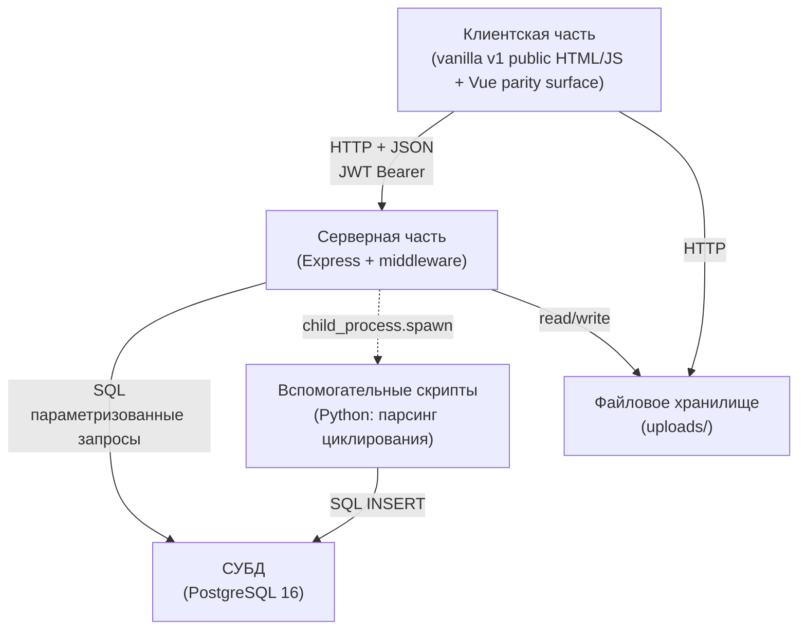

**Обоснование:**

- Единственная точка интеграции с данными (сервер) упрощает ролевой контроль и аудит.
- Клиент отделён от БД: изменения схемы не требуют обновления клиента, если API сохраняет контракт.
- Express + PostgreSQL — проверенное сочетание с низкой стоимостью поддержки.

## 3.3. Обоснование выбора технологического стека

### 3.3.1. Серверная часть — Node.js + Express

**Рассмотренные альтернативы:** Python/FastAPI, Go, Java/Spring Boot, .NET.

**Критерии выбора:**

| Критерий | Node.js + Express | Python/FastAPI | Go | Java/Spring | .NET |
|---|---|---|---|---|---|
| Порог входа для команды из 2 человек | Низкий | Низкий | Средний | Высокий | Средний |
| Производительность (для данного профиля нагрузки) | Достаточная | Достаточная | Высокая | Высокая | Высокая |
| Экосистема для REST + JSON + JWT | Зрелая | Зрелая | Зрелая | Зрелая | Зрелая |
| Единый язык с клиентом (JavaScript) | Да | Нет | Нет | Нет | Нет |
| Стоимость лицензий | Нет | Нет | Нет | Нет (OpenJDK) | Нет (Core) |

**Принятое решение:** Node.js + Express. Ключевой аргумент — **единый язык программирования** на клиенте и сервере (JavaScript), что снижает когнитивную нагрузку на команду из 2 человек и устраняет необходимость в отдельных типах данных для клиента и сервера.

### 3.3.2. Клиентская часть — vanilla v1 + Vue parity handoff

**Рассмотренные альтернативы:** продолжение работы со статическими HTML-страницами, Vue 3 SPA, React, Angular, Svelte.

**Принятое текущее решение для pilot release candidate:** vanilla v1 в `public/` является операторской поверхностью, описываемой в текущих разделах ЕСПД. Этот выбор оправдан тем, что именно vanilla-страницы сейчас содержат проверенное release-candidate поведение для workflow/reference страниц: page-local фильтры, opened-record sticky headers, текущие print reports, DB-backed files, derived battery status и guided destructive flows.

**Vue 3 + Vite + Pinia:** параллельная frontend-поверхность сохранена в `client-web/` и должна синхронизироваться с vanilla v1 по `docs/instructions/frontend_parity_handoff.md`. Её преимущества (component model, Vite dev loop, Pinia, PrimeVue) остаются релевантными для дальнейшей разработки, но текущая формальная документация не должна описывать Vue-расхождения как реализованное vanilla v1 поведение.

### 3.3.3. СУБД — PostgreSQL 16

**Рассмотренные альтернативы:** MySQL/MariaDB, SQLite, MS SQL Server.

**Принятое решение:** PostgreSQL 16.

**Обоснование:**

- **Зрелая поддержка JSON.** Позволяет хранить гибкие фрагменты данных (параметры процессов, метаданные файлов) без жёсткой схемы.
- **Расширенная работа с временными метками и часовыми поясами** (`timestamptz`).
- **Поддержка advisory locks** — ключевой механизм для защиты от перебора паролей без необходимости вносить блокировки в строковые таблицы.
- **Бесплатная лицензия** (PostgreSQL License — близка к BSD).
- **Зрелый набор инструментов для резервного копирования** (`pg_dump`, `pg_basebackup`, WAL-archiving).
- **Строгое соблюдение SQL-стандартов** — обеспечивает переносимость запросов при гипотетической миграции.

### 3.3.4. Python для парсера циклирования

Использование Python для единственной задачи — парсинга протоколов циклирующего оборудования — оправдано:

- **Обилие готовых библиотек для парсинга.** Хотя собственный парсер в `scripts/parse_cycling.py` не использует внешних библиотек, возможность их быстрого подключения важна на случай появления новых форматов.
- **Традиция использования Python в лабораторных расчётах.** Если в будущем потребуется перенести часть обсчёта (например, построение графиков) на серверную часть, Python-компонент можно расширить без изменения основного стека.

### 3.3.5. Язык идентификаторов: английский (в коде) + русский (в UI)

**Принятое решение:**

- Идентификаторы таблиц, полей, функций, переменных — **на английском языке** (транслитерация не используется).
- Тексты интерфейса, сообщения об ошибках — **на русском языке**.
- Комментарии в коде — преимущественно **на английском языке**; допускается смешанное использование.

**Обоснование:** общепринятая международная практика разработки. Использование кириллицы в идентификаторах затрудняет работу с большинством инструментов разработки (отладчики, анализаторы, линтеры).

## 3.4. Описание логической модели данных

### 3.4.1. Верхнеуровневая модель сущностей

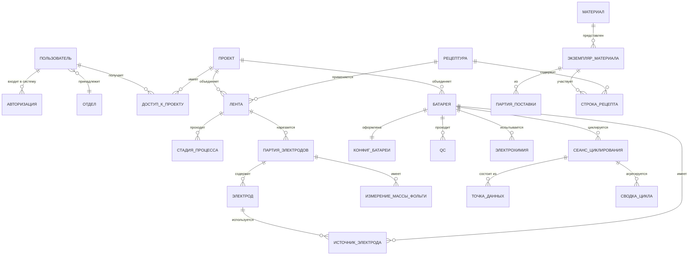

### 3.4.2. Деление сущностей на домены

Все сущности базы данных разделены на **девять доменов**:

| № | Домен | Ответственность |
|---|---|---|
| 1 | Пользователи и доступ | Идентификация, ролевая модель, разграничение доступа, журналы |
| 2 | Справочники материалов и рецептов | Материалы, их экземпляры, партии поставки, свойства, рецептуры |
| 3 | Справочники оборудования и методов | Методы смешивания, сушки, каландрирования; типы электролитов; геометрии |
| 4 | Рабочий процесс — ленты | Восьмистадийный процесс, фактические значения рецептуры |
| 5 | Рабочий процесс — электроды | Партии нарезки, индивидуальные электроды, измерения массы фольги |
| 6 | Рабочий процесс — батареи | Сборка, QC, электрохимические испытания, форм-факторы |
| 7 | Рабочий процесс — модули | Подготовленные таблицы и placeholder-страница; не входит в текущий vanilla v1 workflow |
| 8 | Испытания — циклирование | Сеансы, точки данных, агрегаты по циклам |
| 9 | Аудит | Append-only журналы действий и изменений |

Детальные схемы доменов приводятся ниже (разделы 3.4.3–3.4.11).

### 3.4.3. Домен «Пользователи и доступ»

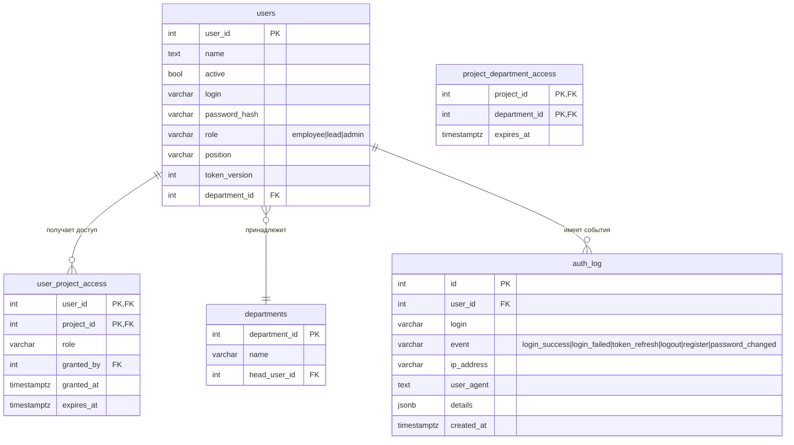

**Ключевые правила:**

- `auth_log` — append-only; UPDATE и DELETE запрещены;
- Роль пользователя (`role`) — одно из значений `admin` / `lead` / `employee`; хранится в `users`, а не в отдельной таблице, т.к. количество ролей ограничено тремя;
- Срок действия доступа (`expires_at`) позволяет автоматически ограничивать доступ без ручного отзыва;
- `token_version` инкрементируется при смене пароля, что приводит к инвалидации всех ранее выданных токенов пользователя.

### 3.4.4. Домен «Материалы»

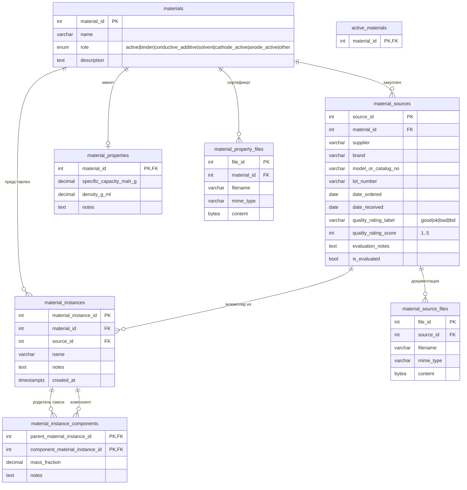

**Ключевые правила** (актуальные рабочие источники — `docs/current/materials.md`, `docs/rules/material_composition_rules.md`, `docs/current/capacity_calculations.md`):

- Материал (`materials`) — абстрактная химическая сущность; сам по себе не используется в рабочих процессах.
- Экземпляр материала (`material_instances`) — конкретный физически существующий объект: закупленная партия, приготовленная смесь, раствор.
- Рекурсивная таблица `material_instance_components` позволяет описать смесь: «экземпляр X состоит из экземпляра A с долей 0.75 и экземпляра B с долей 0.25».
- Партия поставки (`material_sources`) описывает закупленный продукт. Связь `material_instances.source_id` обязательна для чистых закупленных экземпляров и равна `NULL` для смесей.
- `active_materials` — устаревающая таблица активных материалов. Текущая логика расчёта ёмкости опирается на каноническое поле `material_properties.specific_capacity_mah_g`; старое написание `specific_capacity_mAh_g` сохраняется только как совместимый alias в отдельных API/UI местах.

### 3.4.5. Домен «Рецептуры и фактические значения»

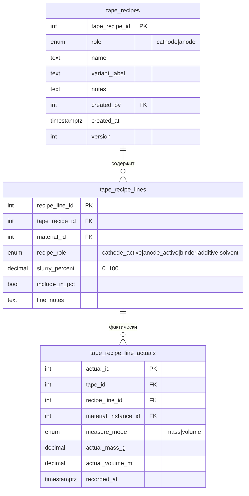

**Ключевые правила:**

- `tape_recipes.role` — `cathode` / `anode` (отдельный enum `electrode_role`); определяет, является ли рецепт катодным или анодным.
- `tape_recipe_lines` ссылается на **абстрактный** материал (`material_id`), а не на конкретный экземпляр. Это корректно — рецепт описывает «что и в какой пропорции», а выбор конкретной партии экземпляра происходит на этапе фактических значений (`tape_recipe_line_actuals.material_instance_id`).
- `slurry_percent` — теоретическая массовая доля компонента в сухом остатке, в процентах (0..100; CHECK-ограничение). Например: 96% катодного активного, 2% связующего, 2% проводящей добавки.
- Флаг `include_in_pct = true` указывает, что строка участвует в пересчёте суммы долей; растворитель (`solvent`) обычно имеет `include_in_pct = false` и `slurry_percent = NULL` (закреплено CHECK-ограничением).
- `measure_mode` в фактических значениях — один из `mass` / `volume`. CHECK-ограничение БД гарантирует, что ровно одно из полей `actual_mass_g` / `actual_volume_ml` заполнено (или оба `NULL`, если `measure_mode IS NULL`).
- При наличии плотности материала (`material_properties.density_g_ml`) значение, введённое в одном режиме, пересчитывается в другой режим «на лету» сервером для отображения в интерфейсе (но не сохраняется в БД).

### 3.4.6. Домен «Ленты и технологический процесс»

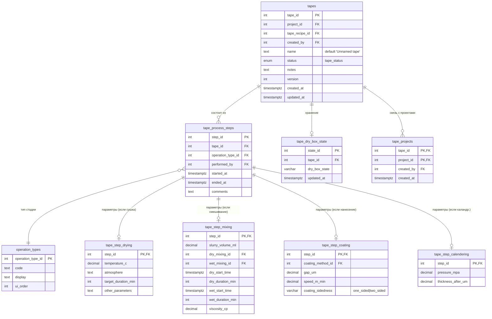

**Ключевые правила:**

- Таблица `tape_process_steps` — общая для всех стадий; тип стадии различается через FK `operation_type_id` → справочник `operation_types` (с кодами вида `drying_am`, `mixing`, `coating`, `drying_tape`, `calendering`, `drying_pressed_tape` и др.).
- Подтаблицы `tape_step_drying`, `tape_step_mixing`, `tape_step_coating`, `tape_step_calendering` хранят параметры, специфичные для типа операции. Связь — `step_id = tape_process_steps.step_id` (общий первичный ключ).
- Таблица `tape_step_drying` — **одна** на все виды сушки (активного материала, ленты после нанесения, каландрированной ленты). Различие этих сушек — через `operation_type_id` родительской строки.
- Таблица `tape_step_mixing` содержит параметры и сухого (`dry_*`), и мокрого (`wet_*`) смешивания в одной строке.
- Стадии «Подготовка материалов» и «Взвешивание» не имеют собственной подтаблицы — данные вводятся в `tape_recipe_line_actuals`.
- `coating_sidedness` — **единственное место** хранения типа нанесения (один раз, на стадии нанесения). На уровне электродов и батарей это значение вычисляется по ссылкам, а не дублируется.
- Поле `version` в `tapes` используется для оптимистичной блокировки.
- Таблица `tape_projects` — связь «многие ко многим» между лентами и проектами (миграция d028). Введена для случаев, когда одна лента используется в нескольких проектах одновременно. Поле `tapes.project_id` (FK к `projects`) сохранено для обратной совместимости с UI и обозначает «исходный» проект ленты; `tape_projects` — расширенный список всех проектов, в которые лента включена.

### 3.4.7. Домен «Электроды»

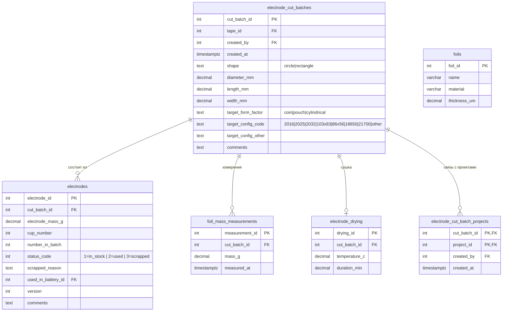

**Ключевые правила:**

- Таблица `electrode_cut_batch_projects` — связь «многие ко многим» между партиями нарезки электродов и проектами (миграция d029). При создании партии в `electrode_cut_batch_projects` копируются проекты родительской ленты из `tape_projects` и, для совместимости, fallback-проект из `tapes.project_id`. Прямого legacy-поля `project_id` у `electrode_cut_batches` нет.

### 3.4.8. Домен «Батареи»

```mermaid
erDiagram
    batteries {
        int battery_id PK
        int project_id FK
        int created_by FK
        text form_factor "coin|pouch|cylindrical"
        enum status "battery_status"
        text battery_notes
        int version
        timestamptz created_at
        timestamptz updated_at
    }
    battery_coin_config {
        int battery_id PK,FK
        varchar coin_cell_mode "half_cell|full_cell"
        varchar half_cell_type
        varchar coin_size_code "2016|2025|2032"
        varchar coin_layout "SE|ES|ESE"
        decimal spacer_thickness_mm
        int spacer_count
    }
    battery_pouch_config {
        int battery_id PK,FK
        varchar pouch_case_size
        int stack_layers
    }
    battery_cyl_config {
        int battery_id PK,FK
        decimal diameter_mm
        decimal height_mm
    }
    battery_electrode_sources {
        int source_id PK
        int battery_id FK
        int tape_id FK
        int cut_batch_id FK
        enum role "cathode|anode"
    }
    battery_electrodes {
        int battery_id PK,FK
        int electrode_id PK,FK
        int stack_position
        enum role "cathode|anode"
    }
    battery_electrolyte {
        int battery_id PK,FK
        int electrolyte_id FK
        decimal volume_ml
    }
    battery_sep_config {
        int battery_id PK,FK
        int separator_id FK
    }
    battery_qc {
        int qc_id PK
        int battery_id FK
        decimal mass_g
        decimal thickness_mm
        text visual_inspection
        timestamptz performed_at
    }
    battery_electrochem {
        int battery_electrochem_id PK
        int battery_id FK
        varchar file_name
        varchar file_link
        text electrochem_notes
        timestamptz uploaded_at
    }
    battery_projects {
        int battery_id PK,FK
        int project_id PK,FK
        int created_by FK
        timestamptz created_at
    }

    batteries ||--o| battery_coin_config : "если coin"
    batteries ||--o| battery_pouch_config : "если pouch"
    batteries ||--o| battery_cyl_config : "если cylindrical"
    batteries ||--o{ battery_electrode_sources : "источник"
    batteries ||--o{ battery_electrodes : "в стеке"
    batteries ||--o| battery_electrolyte : "содержит"
    batteries ||--o| battery_sep_config : "сепаратор"
    batteries ||--o{ battery_qc : "QC"
    batteries ||--o{ battery_electrochem : "испытания"
    batteries ||--o{ battery_projects : "связь с проектами"
```

**Ключевые правила** (актуальные рабочие источники — `docs/current/batteries.md` и `docs/rules/electrode_stack_rules.md`):

Поле `batteries.form_factor` имеет CHECK-ограничение на значения `coin | pouch | cylindrical`. Распознавание полуячейки производится через подтаблицу `battery_coin_config.coin_cell_mode` (`half_cell` | `full_cell`).

| Логическая конфигурация | `form_factor` | `coin_cell_mode` | Источников в `battery_electrode_sources` | Электродов в `battery_electrodes` |
|---|---|---|---|---|
| Монета половинная | `coin` | `half_cell` | Ровно один (или катод, или анод) | Один электрод |
| Монета полная | `coin` | `full_cell` | Ровно один катод + один анод | Один катод + один анод |
| Pouch | `pouch` | — | Ровно один катод + один анод | `аноды = катоды` или `аноды = катоды + 1`; лишний катод запрещён |
| Цилиндрическая | `cylindrical` | — | Ровно один катод + один анод | `аноды = катоды` или `аноды = катоды + 1`; лишний катод запрещён |

Отдельные таблицы `battery_coin_config` / `battery_pouch_config` / `battery_cyl_config` хранят параметры, специфичные для форм-фактора. Таблица `battery_coin_config` содержит `coin_size_code` (2016 / 2025 / 2032), `coin_layout` (SE / ES / ESE), толщину и количество проставок.

Таблица `battery_projects` — связь «многие ко многим» между батареями и проектами (миграция d030). Поле `batteries.project_id` сохранено для обратной совместимости и обозначает «исходный» проект; `battery_projects` — расширенный список всех проектов, в которые батарея включена.

Миграция `d031_harden_battery_stack_validate_trigger.sql` обновляет DB-триггер `validate_battery_stack()` под это правило стека. Сервис `batteryElectrodeStackService.js` сохраняет строки в trigger-safe paired order `A1, C1, A2, C2` (анод перед соответствующим катодом), но исходные `position_index` не меняет.

### 3.4.9. Домен «Справочники оборудования и методов»

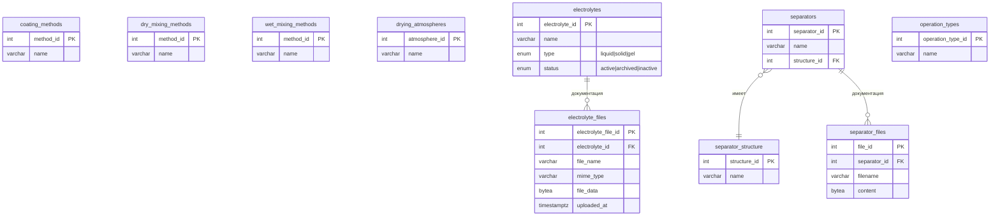

### 3.4.10. Домен «Циклирование»

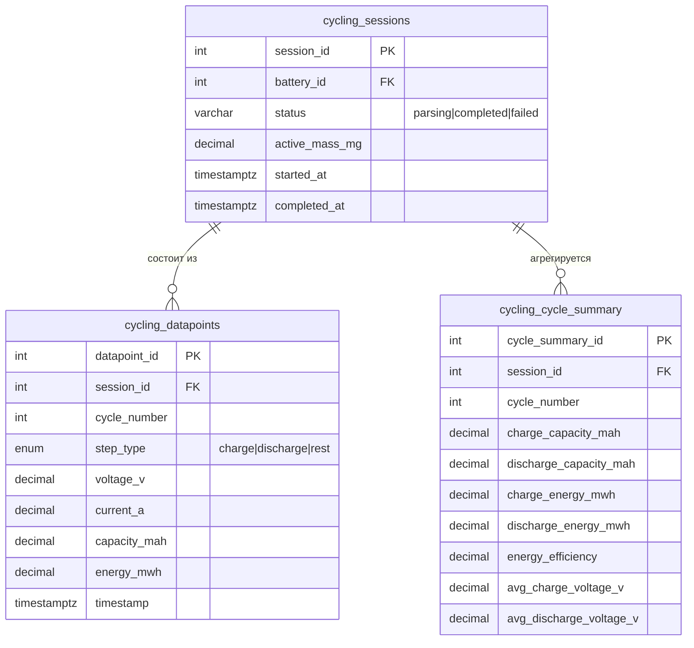

### 3.4.11. Домен «Модули»

По состоянию на 09.05.2026 подсистема модулей не реализована как текущий рабочий процесс vanilla v1. В `public/workflow/4-modules.html` доступна страница-заглушка; таблицы `modules`, `module_batteries`, `module_qc` остаются в модели как подготовленная область, а наличие `module_batteries` учитывается как hard blocker для guided battery delete.

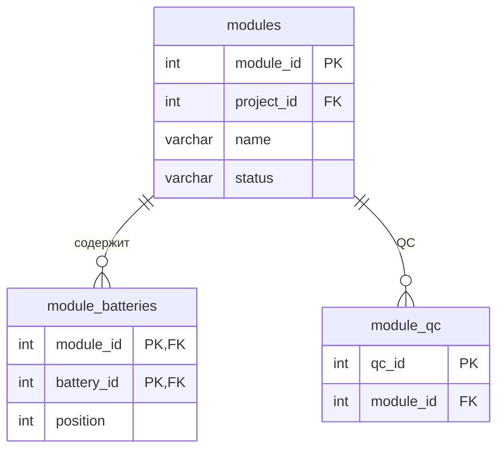

### 3.4.12. Домен «Аудит»

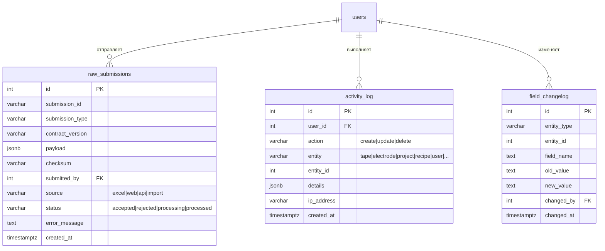

**Ключевые правила:** все три таблицы — **append-only**. Ограничение реализуется на уровне бизнес-логики (middleware); UPDATE и DELETE в этих таблицах запрещены в серверных маршрутах.

## 3.5. Описание физической структуры базы данных

### 3.5.1. Общая статистика

На текущий момент (09.05.2026, локальная БД `badb_app_v1`) база данных содержит:

| Показатель | Значение |
|---|---|
| Количество таблиц | 65 public tables |
| Количество типов-перечислений (ENUM) | 12 |
| Количество внешних ключей | 103 |
| Количество миграций | 42 SQL-файла в `migrations/` и 42 SQL-файла в `migrations_ASCII/`: базовый диапазон `001`–`020` плюс Dalia-миграции `d013`–`d033` |
| Authoritative migration ledger | `public.schema_migrations` (`dima = 21`, `dalia = 21` после `d033`); flat `migrations_log.txt` — human checkpoint notes only |
| Тип первичных ключей | SERIAL (int, автоинкремент) |

### 3.5.2. Конвенции именования

| Объект | Конвенция | Пример |
|---|---|---|
| Таблица | snake_case, множественное число | `material_instances` |
| Первичный ключ | `<сущность>_id` | `material_instance_id` |
| Внешний ключ | совпадает с PK ссылаемой таблицы | `material_id` |
| Поле временной метки | `<событие>_at` | `created_at`, `updated_at` |
| Поле статуса | `status` (с ENUM-типом) | `tapes.status` |
| Булево поле | `is_<предикат>` или `has_<предикат>` | `is_evaluated` |

### 3.5.3. Типы данных

| Случай использования | Тип PostgreSQL |
|---|---|
| Целое число (ID, счётчик) | `INTEGER` |
| Дробное (масса, доля, размер) | `DECIMAL(p,s)` с явным указанием точности |
| Короткая строка | `VARCHAR(n)` |
| Длинный текст | `TEXT` |
| Временная метка | `TIMESTAMPTZ` (с часовым поясом) |
| Дата без времени | `DATE` |
| IP-адрес | `INET` |
| Бинарные данные DB-backed вложений | `BYTEA` |
| Гибкие структурированные данные | `JSONB` |
| Перечисление | `ENUM` на уровне БД (сериализация в строку) |

### 3.5.4. Ограничения целостности

- **Первичные ключи** на всех таблицах.
- **Внешние ключи** с явным указанием политики при удалении (`ON DELETE CASCADE` / `SET NULL` / `RESTRICT`).
- **CHECK-ограничения** на полях с дискретным набором значений (там, где ENUM неудобен).
- **UNIQUE-индексы** на естественных ключах (например, `users.login`).
- **Триггеры** на автоматическое обновление `updated_at` при UPDATE (миграции `d013`, `d014`, `d015`).

## 3.6. Описание потоков данных

### 3.6.1. Поток данных для создания ленты

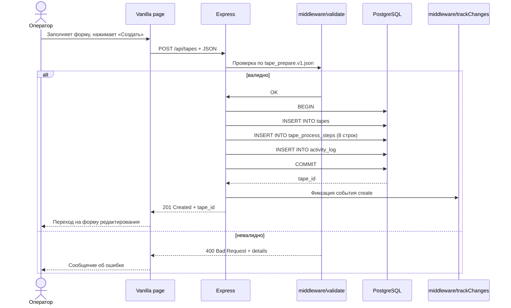

### 3.6.2. Поток данных для расчёта ёмкости партии электродов

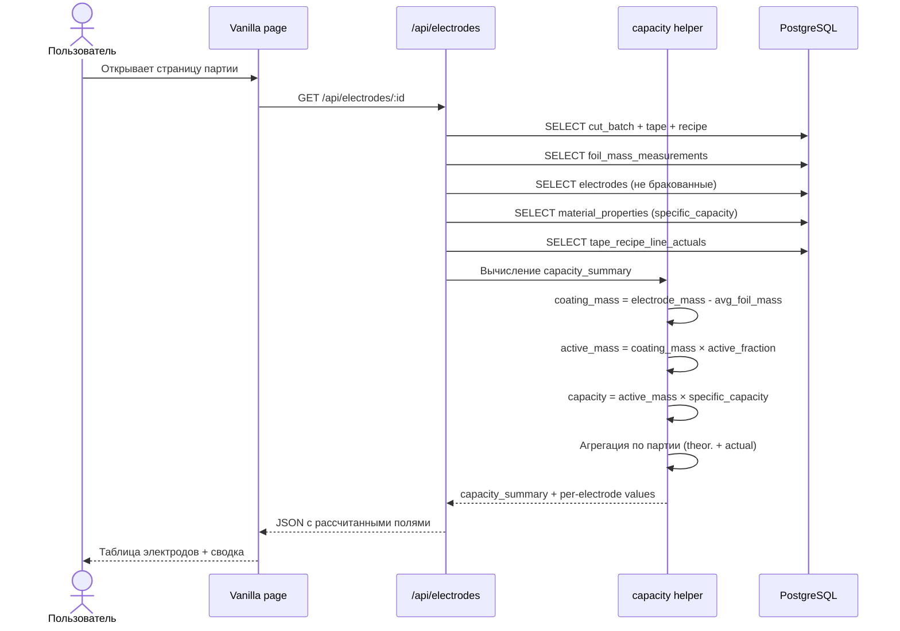

### 3.6.3. Поток данных для загрузки файла циклирования

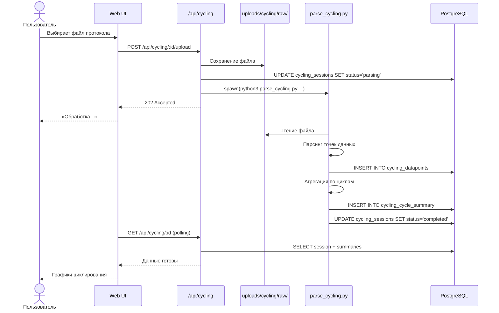

## 3.7. Обоснование решений по безопасности

Подробные требования к безопасности — в разделе 4.8 **ТЗ**. Здесь приведено обоснование принятых решений.

### 3.7.1. Выбор JWT вместо сессий на сервере

**Принятое решение:** использовать JWT Bearer-токены, подписываемые симметричным ключом `JWT_SECRET`.

**Обоснование:**

- Сервер не хранит состояние сессии (stateless): масштабирование не требует общего хранилища сессий.
- Короткий срок жизни токена (8 часов) + возможность принудительной инвалидации через `token_version` обеспечивают приемлемый баланс между удобством и безопасностью.
- Клиент передаёт токен в заголовке `Authorization`, что исключает атаки CSRF, характерные для cookie-сессий.

### 3.7.2. bcrypt для хеширования паролей

**Принятое решение:** bcrypt (не менее 10 раундов).

**Обоснование:** bcrypt преднамеренно медленный алгоритм с настраиваемой вычислительной сложностью; устойчив к атакам на GPU. Альтернативы (argon2, scrypt) рассматривались, но bcrypt выбран из-за зрелости библиотеки `bcryptjs` и достаточности для профиля угроз (внутренний LAN).

### 3.7.3. Advisory lock при защите от перебора

**Принятое решение:** `pg_advisory_xact_lock(hashtext(login))` при каждой неуспешной попытке входа.

**Обоснование:** без блокировки параллельные попытки перебора с нескольких клиентов могли бы обойти лимит 10 попыток (каждый поток читал бы актуальное значение счётчика до его обновления другими). Advisory lock сериализует обработку попыток для одного логина, не блокируя попытки для других логинов.

### 3.7.4. Append-only журналы

**Принятое решение:** таблицы `auth_log`, `activity_log`, `field_changelog`, `raw_submissions` не допускают UPDATE и DELETE.

**Обоснование:** в лабораторной среде важна целостность истории действий. Попытка вредоносного или случайного «зачистки следов» не должна быть возможна из интерфейса приложения. Физическое удаление данных средствами СУБД (от имени суперпользователя) остаётся возможным для нештатных ситуаций.

### 3.7.5. Запрет внешних API

**Принятое решение:** никаких HTTP-запросов из серверной и клиентской частей на внешние сервисы.

**Обоснование:** требование безопасности контура ООО «РЭНЕРА». Соответствие проверяется при ревью кода; сборка клиентской части не содержит ссылок на внешние CDN или трекинг-сервисы.

---

# 4. Ожидаемые технико-экономические показатели

## 4.1. Показатели использования

На основе фактического использования в ходе разработки:

| Показатель | Оценка |
|---|---|
| Количество активных пользователей (на старте) | 10–20 |
| Количество активных пользователей (цель) | 30–50 |
| Размер БД (текущий) | ~50 МБ без файлов; ~500 МБ с файлами |
| Размер БД (через 2 года эксплуатации, оценочно) | 2–5 ГБ |
| Количество запросов в день (оценочно) | 5 000 – 20 000 |

## 4.2. Экономический эффект

Раздел имеет справочный характер для внутренней разработки. Количественная оценка эффекта не приводится.

Ожидаемые качественные эффекты:

- **Сокращение времени на поиск экспериментальных данных прошлых опытов.** Предварительная оценка: 10–30 минут сэкономленных человеко-часов на поиск результатов одного эксперимента (ранее — до 4 часов при поиске по Excel-файлам и личным заметкам).
- **Уменьшение количества ошибок ввода** за счёт валидации по JSON-схемам и автозаполнения из справочников. Предварительная оценка — снижение доли ошибочных записей на 30–70 %.
- **Повышение воспроизводимости экспериментов** — полная фиксация параметров процесса исключает необходимость в «устных» знаниях.
- **Возможность ретроспективного анализа** — например, корреляция показателей батареи с поставщиком исходного материала.

## 4.3. Стоимость разработки

ПО разрабатывается штатными сотрудниками ООО «РЭНЕРА» в рамках должностных обязанностей. Отдельный бюджет на разработку не выделяется.

Сторонние лицензии не используются:

- PostgreSQL — свободная лицензия (PostgreSQL License, аналог BSD);
- Node.js — MIT;
- Vanilla frontend использует HTML/JavaScript/CSS без отдельной runtime-лицензии;
- Vue 3, Vite, Pinia — MIT (для отдельной frontend parity-поверхности);
- Express — MIT;
- PrimeVue — MIT (для отдельной frontend parity-поверхности);
- библиотеки клиента и сервера — совместимые с коммерческим использованием свободные лицензии.

---

# 5. Источники разработки

## 5.1. Нормативные документы

- ГОСТ 19.201-78. ЕСПД. Техническое задание.
- ГОСТ 19.301-79. ЕСПД. Программа и методика испытаний.
- ГОСТ 19.402-78. ЕСПД. Описание программы.
- ГОСТ 19.404-79. ЕСПД. Пояснительная записка.
- ГОСТ 19.503-79. ЕСПД. Руководство системного программиста.
- ГОСТ 19.505-79. ЕСПД. Руководство оператора.
- Гражданский кодекс РФ, часть 4 (об интеллектуальной собственности).

## 5.2. Техническая документация

- Официальная документация PostgreSQL 16 (https://www.postgresql.org/docs/16/).
- Документация Node.js 22 (https://nodejs.org/dist/latest-v22.x/docs/api/).
- Документация Vue 3 (https://vuejs.org/) — для frontend parity/handoff работ.
- Документация Express (https://expressjs.com/).
- Спецификация JSON Schema Draft-07 (https://json-schema.org/specification.html).
- RFC 7519 — JSON Web Token (https://datatracker.ietf.org/doc/html/rfc7519).

## 5.3. Научные источники

Научные принципы расчёта ёмкости, N/P-отношения, оценки уровня брака электродов и другие доменные формулы — из публикаций в области электрохимии химических источников тока. Конкретные формулы и интерпретации согласованы с руководителем разработки (Мараулайте Даля Казевна) на основе методик, принятых в Центре химических источников тока ООО «РЭНЕРА».

## 5.4. Внутренние документы разработки

Актуальные рабочие источники, использованные при формировании настоящей записки:

- `BADB_main/` — код приложения и фактическая реализация.
- `BADB_main/migrations/` — схема БД и forward-only изменения.
- `BADB_main/docs/current/` — сжатое описание текущих реализованных функций.
- `BADB_main/docs/rules/` — правила доменной логики и совместимости.
- `BADB_main/docs/instructions/` — процедуры запуска, миграций, проверок и релиза.
- `BADB_main/docs/archive/superseded/` — исторический контекст происхождения решений; не источник истины без сверки с кодом и каноническими docs.

---

# 6. Приложения

## Приложение А. Полный перечень таблиц базы данных

### Домен «Пользователи и доступ»

| Таблица | Назначение |
|---|---|
| `users` | Учётные записи пользователей |
| `departments` | Справочник отделов (лабораторий) |
| `user_project_access` | Права доступа пользователей к проектам |
| `project_department_access` | Права доступа отделов к проектам |
| `auth_log` | Append-only журнал аутентификации |
| `activity_log` | Append-only журнал CRUD-действий |
| `field_changelog` | Append-only журнал изменений отдельных полей |
| `schema_migrations` | Authoritative ledger применённых миграций, созданный/backfill-нутый `d032_create_schema_migrations_table.sql` |

### Домен «Справочники»

| Таблица | Назначение |
|---|---|
| `materials` | Абстрактные определения материалов |
| `material_instances` | Конкретные экземпляры материалов |
| `material_instance_components` | Рекурсивное описание смесей |
| `material_sources` | Партии поставки |
| `material_properties` | Свойства материалов (specific_capacity, density) |
| `material_source_files` | Файлы, прикреплённые к партиям поставки |
| `material_property_files` | Файлы, прикреплённые к свойствам материалов |
| `active_materials` | Выделенные экземпляры активных материалов (катодные, анодные) со своей теоретической ёмкостью; связь с `material_instances.material_instance_id` |
| `tape_recipes` | Рецептуры ленты |
| `tape_recipe_lines` | Строки рецептур |
| `tape_recipe_line_actuals` | Фактические значения строк рецептур |
| `projects` | Проекты |
| `electrolytes` | Справочник электролитов |
| `electrolyte_files` | Файлы электролитов |
| `separators` | Справочник сепараторов |
| `separator_structure` | Структуры сепараторов |
| `separator_files` | Файлы сепараторов |
| `foils` | Справочник фольг-токосъёмников |
| `coating_methods` | Методы нанесения покрытия |
| `dry_mixing_methods` | Методы сухого смешивания |
| `wet_mixing_methods` | Методы мокрого смешивания |
| `drying_atmospheres` | Типы атмосферы сушки |
| `operation_types` | Типы операций (справочник) |
| `electrode_status` | Справочник числовых кодов статусов электродов (сопоставление `status_code` → человекочитаемое название) |

### Домен «Рабочий процесс — ленты»

| Таблица | Назначение |
|---|---|
| `tapes` | Ленты |
| `tape_projects` | Связь «многие ко многим» между лентами и проектами |
| `tape_process_steps` | Стадии процесса изготовления ленты |
| `tape_step_drying` | Параметры стадий сушки |
| `tape_step_mixing` | Параметры смешивания |
| `tape_step_coating` | Параметры нанесения покрытия (с `coating_sidedness`) |
| `tape_step_calendering` | Параметры каландрирования |
| `tape_dry_box_state` | Состояние ленты в перчаточном боксе |

### Домен «Рабочий процесс — электроды»

| Таблица | Назначение |
|---|---|
| `electrode_cut_batches` | Партии нарезки электродов |
| `electrode_cut_batch_projects` | Связь «многие ко многим» между партиями нарезки и проектами |
| `electrodes` | Индивидуальные электроды |
| `foil_mass_measurements` | Измерения массы фольги |
| `electrode_drying` | Параметры сушки электродов после нарезки |

### Домен «Рабочий процесс — батареи»

| Таблица | Назначение |
|---|---|
| `batteries` | Батареи |
| `battery_projects` | Связь «многие ко многим» между батареями и проектами |
| `battery_coin_config` | Конфигурация монетных батарей |
| `battery_pouch_config` | Конфигурация pouch-батарей |
| `battery_cyl_config` | Конфигурация цилиндрических батарей |
| `battery_electrode_sources` | Источники электродов батареи |
| `battery_electrodes` | Электроды в стеке батареи |
| `battery_electrolyte` | Привязка электролита |
| `battery_sep_config` | Привязка сепаратора |
| `battery_qc` | QC-параметры батареи |
| `battery_electrochem` | Файлы и notes-only записи электрохимических испытаний |

### Домен «Рабочий процесс — модули» (подготовленная область)

| Таблица | Назначение |
|---|---|
| `modules` | Модули |
| `module_batteries` | Батареи в составе модуля |
| `module_qc` | QC модуля |

### Домен «Циклирование»

| Таблица | Назначение |
|---|---|
| `cycling_sessions` | Сеансы циклирования |
| `cycling_datapoints` | Точки данных циклирования |
| `cycling_cycle_summary` | Агрегаты по циклам |

### Домен «Поступление данных»

| Таблица | Назначение |
|---|---|
| `raw_submissions` | Append-only журнал сырых заявок |

### Домен «Обратная связь»

| Таблица | Назначение |
|---|---|
| `feedback` | Пользовательские сообщения |
| `feedback_attachments` | Прикреплённые файлы |

## Приложение Б. Рекомендации по генерации полной ER-диаграммы

Для построения полной единой ER-диаграммы (с отрисовкой всех таблиц и всех связей) рекомендуется использовать автоматизированные средства, подключающиеся непосредственно к БД:

1. **eralchemy** (Python): `eralchemy -i "postgresql+psycopg2://..." -o erd.svg`
2. **SchemaSpy** (Java): генерирует HTML-отчёт с кликабельной схемой.
3. **pgAdmin** — встроенный визуальный редактор схемы.
4. **DBeaver** — построение диаграммы из метаданных БД.

Эти инструменты рекомендуется применять в начале этапа опытной эксплуатации для получения «снимка» актуальной схемы и вложения его в состав документации как приложения.

## Приложение В. Перечень сокращений

См. Приложение А ТЗ.

## Приложение Г. Перечень ссылочных документов

- BADB.00001-01 — «Техническое задание».
- BADB.00001-01 13 01 — «Описание программы».
- BADB.00001-01 34 01 — «Руководство оператора».
- BADB.00001-01 32 01 — «Руководство системного программиста».
- BADB.00001-01 51 01 — «Программа и методика испытаний».

*Обозначения документов — по действующему ГОСТ 19.103-77; уточнить принятую в ООО «РЭНЕРА» систему обозначений.*

---

**Конец документа.**
